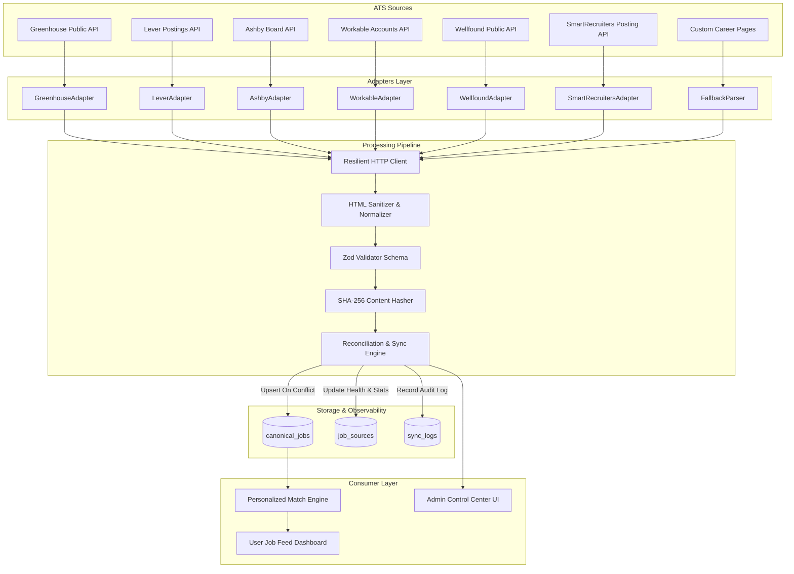

# Production Job Ingestion System Architecture & Technical Specification

## 1. Executive Summary

Openned's **Production Job Ingestion System** is an enterprise-grade, modular, and self-healing job discovery and synchronization engine. It collects live career postings directly from major Applicant Tracking Systems (ATS) and public feeds—including **Greenhouse**, **Lever**, **Ashby**, **Workable**, **Wellfound**, **SmartRecruiters**, and a **JSON-LD/HTML Fallback Parser**—normalizes them into a canonical schema, and stores them idempotently in Supabase PostgreSQL.

---

## 2. System Architecture



---

## 3. Existing Architecture Integration

### Runtime & Framework
- **Runtime**: Node.js & TypeScript
- **Framework**: Next.js 16 (App Router) & React 19
- **Database & Auth**: Supabase PostgreSQL with Row Level Security (RLS) and SSR Auth session management
- **AI & Scoring**: Gemini / Profile keyword overlap scoring engine

### Backward Compatibility
The system is built to seamlessly coexist with existing `profiles`, `skills`, `experiences`, and legacy `jobs` tables while promoting `canonical_jobs` as the single source of truth for global job postings. User bookmarking (`saved_status`) and application state (`applied_status`) are tracked via `user_job_interactions`.

---

## 4. Database Schema & Migration

### `job_sources`
Stores ATS configuration, provider metadata, health metrics, and failure counters.
```sql
CREATE TABLE public.job_sources (
    id UUID PRIMARY KEY DEFAULT gen_random_uuid(),
    source TEXT NOT NULL, -- 'greenhouse' | 'lever' | 'ashby' | 'workable' | 'custom'
    source_name TEXT NOT NULL,
    source_identifier TEXT NOT NULL, -- e.g. 'stripe', 'figma', 'openai'
    company_name TEXT NOT NULL,
    company_logo TEXT,
    source_url TEXT NOT NULL,
    enabled BOOLEAN NOT NULL DEFAULT true,
    last_synced_at TIMESTAMPTZ,
    last_success_at TIMESTAMPTZ,
    last_error_at TIMESTAMPTZ,
    last_error_message TEXT,
    consecutive_failures INTEGER NOT NULL DEFAULT 0,
    metadata JSONB DEFAULT '{}'::jsonb,
    created_at TIMESTAMPTZ NOT NULL DEFAULT now(),
    updated_at TIMESTAMPTZ NOT NULL DEFAULT now(),
    CONSTRAINT unique_source_identifier UNIQUE (source, source_identifier)
);
```

### `canonical_jobs`
Stores globally normalized job postings.
```sql
CREATE TABLE public.canonical_jobs (
    id UUID PRIMARY KEY DEFAULT gen_random_uuid(),
    source TEXT NOT NULL,
    source_job_id TEXT NOT NULL,
    source_id UUID REFERENCES public.job_sources(id) ON DELETE SET NULL,
    company_name TEXT NOT NULL,
    company_logo TEXT,
    title TEXT NOT NULL,
    description TEXT,
    description_html TEXT,
    location TEXT,
    locations_json JSONB DEFAULT '[]'::jsonb,
    country TEXT,
    region TEXT,
    city TEXT,
    remote_type TEXT, -- 'remote' | 'hybrid' | 'onsite'
    employment_type TEXT, -- 'full-time' | 'part-time' | 'contract' | 'internship'
    department TEXT,
    team TEXT,
    salary_min NUMERIC,
    salary_max NUMERIC,
    salary_currency TEXT,
    salary_interval TEXT, -- 'yearly' | 'monthly' | 'hourly'
    job_url TEXT NOT NULL,
    apply_url TEXT NOT NULL,
    posted_at TIMESTAMPTZ,
    updated_at_source TIMESTAMPTZ,
    scraped_at TIMESTAMPTZ NOT NULL DEFAULT now(),
    first_seen_at TIMESTAMPTZ NOT NULL DEFAULT now(),
    last_seen_at TIMESTAMPTZ NOT NULL DEFAULT now(),
    active BOOLEAN NOT NULL DEFAULT true,
    raw_payload JSONB,
    content_hash TEXT NOT NULL,
    created_at TIMESTAMPTZ NOT NULL DEFAULT now(),
    updated_at TIMESTAMPTZ NOT NULL DEFAULT now(),
    CONSTRAINT unique_source_job UNIQUE (source, source_job_id)
);
```

### `user_job_interactions`
Tracks user-specific bookmarks, applications, and notes against canonical jobs.
```sql
CREATE TABLE public.user_job_interactions (
    id UUID PRIMARY KEY DEFAULT gen_random_uuid(),
    user_id TEXT NOT NULL,
    canonical_job_id UUID NOT NULL REFERENCES public.canonical_jobs(id) ON DELETE CASCADE,
    saved_status BOOLEAN NOT NULL DEFAULT false,
    applied_status BOOLEAN NOT NULL DEFAULT false,
    applied_at TIMESTAMPTZ,
    notes TEXT,
    created_at TIMESTAMPTZ NOT NULL DEFAULT now(),
    updated_at TIMESTAMPTZ NOT NULL DEFAULT now(),
    CONSTRAINT unique_user_canonical_job UNIQUE (user_id, canonical_job_id)
);
```

### `sync_logs`
Detailed audit log for every sync run.
```sql
CREATE TABLE public.sync_logs (
    id UUID PRIMARY KEY DEFAULT gen_random_uuid(),
    source_id UUID REFERENCES public.job_sources(id) ON DELETE SET NULL,
    source TEXT NOT NULL,
    status TEXT NOT NULL, -- 'started' | 'success' | 'failed' | 'partial'
    jobs_fetched INTEGER NOT NULL DEFAULT 0,
    jobs_created INTEGER NOT NULL DEFAULT 0,
    jobs_updated INTEGER NOT NULL DEFAULT 0,
    jobs_unchanged INTEGER NOT NULL DEFAULT 0,
    jobs_deactivated INTEGER NOT NULL DEFAULT 0,
    error_message TEXT,
    duration_ms INTEGER NOT NULL DEFAULT 0,
    created_at TIMESTAMPTZ NOT NULL DEFAULT now()
);
```

---

## 5. Deduplication & Idempotency Strategy

1. **Primary Deduplication**: Unique constraint on `(source, source_job_id)`. Repeated ingestion runs perform an atomic PostgreSQL `UPSERT` (`ON CONFLICT DO UPDATE`).
2. **Secondary Semantic Fingerprinting**: SHA-256 hash computed over normalized tuple:
   $$\text{Hash} = \text{SHA256}(\text{company\_name} \parallel \text{title} \parallel \text{location} \parallel \text{description} \parallel \text{apply\_url})$$
   - If the incoming content hash matches the stored hash, the record is marked `unchanged` (updating only `last_seen_at`).
   - If the content hash differs, `updated_at` and mutated fields are refreshed.

---

## 6. Safe Deactivation & Reconciliation Strategy

To prevent active jobs from disappearing when an external API experiences transient outages:
1. When a source is synchronized, the engine tracks all `seen_source_job_ids`.
2. Missing jobs (previously `active = true` for that source but absent in the new payload) are marked `active = false` **only if**:
   - The sync operation completed 100% without network or parse exceptions.
   - The API returned at least one valid job.
3. If an API request fails, returns 0 jobs unexpectedly, or hits a rate limit, existing active jobs remain untouched.

---

## 7. Rate Limiting, Retries & Self-Healing

The HTTP layer (`src/lib/ingestion/http-client.ts`) implements:
- **Timeouts**: `AbortController` timeout (20s default).
- **Exponential Backoff with Full Jitter**:
  $$\text{Delay} = \min(\text{maxDelay}, \text{baseDelay} \times 2^{\text{attempt}}) \pm \text{Jitter}$$
- **Rate Limit (HTTP 429) Handling**: Parses `Retry-After` response header when present, or applies exponential backoff.
- **Server Errors (500, 502, 503, 504)**: Retried up to 3 times before failing the source gracefully.
- **Per-Host Throttling**: Enforces minimum interval between consecutive requests to the same hostname.

---

## 8. Security & Data Protection

- **Credentials Server-Side Only**: All API keys, service role tokens, and cron secrets reside strictly on the server and are never included in client bundles.
- **HTML Sanitization**: All HTML descriptions are stripped of dangerous tags (`<script>`, `<iframe>`, `<object>`, `onclick`, inline event handlers) before storage.
- **URL Validation**: Strict protocol validation (`http:` / `https:`) prevents protocol injection (e.g., `javascript:`).
- **Anti-Bot & Terms Compliance**: Queries official public job board APIs and documented widgets without bypassing CAPTCHAs.

---

## 9. Observability & Admin Management

- **Admin UI**: Located at `/dashboard/admin/sources` featuring real-time health metrics, source toggles, manual sync execution, and audit log history.
- **Structured Logging**: Emits machine-readable logs:
  `[source=greenhouse] [event=sync_started] [source_identifier=stripe]`
  `[source=greenhouse] [event=job_created] [source_job_id=4829102] [title="Staff Software Engineer"]`
  `[source=greenhouse] [event=sync_completed] [fetched=45] [created=12] [updated=4] [unchanged=29] [deactivated=0] [duration=850ms]`
